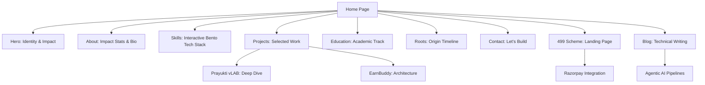

# Portfolio Enhancement Strategy

This document outlines a comprehensive strategy for taking the portfolio to the next level, moving beyond visual refactoring into deep user experience and functional excellence.

## 🚀 Further Improvements & Additions

### 1. Visual & Interactive Polish
*   **Lottie Animations**: Replace the static character image with a Lottie-driven 3D animation that reacts to scroll position or cursor movement. This reinforces the "living" nature of the Claymorphism design.
*   **Claymorphism Dark Mode**: Implement a dark theme using deep charcoals (#1a1a1a) with neon green shadows. Claymorphism looks exceptionally premium in dark mode when depth is represented by light-emitting shadows.
*   **Micro-Interactions (Sound)**: Add subtle "UI feedback sounds"—soft, high-pitched "pops" when hovering over pill-buttons and "thuds" when clicking raised cards.
*   **Custom Bouncy Scrollbar**: A thick, rounded green scrollbar that follows the `var(--clay-radius)` tokens.

### 2. Functional Extensions
*   **Dynamic Case Studies**: Move beyond the "Projects" section by creating dedicated detail pages for each project. Use a "Bento Box" layout to showcase architecture, challenges, and results.
*   **Live Metrics Dashboard**: Since you are a builder (DS @ IIT Madras, CS @ MMMUT), a live dashboard showing "Lines of Code Written", "Coffee Consumed", or "Commits Today" would add a unique engineer's touch.
*   **Blog / Thought Leadership**: A section for technical writing (Next.js patterns, AI Agentic pipelines) to establish authority in the field.

---

## 🗺️ Extended Sitemap & Information Architecture

---

## 🎭 User Personas & Journey Mapping

| User Type | Core Objective | Key Section Focus | Presentation Concept |
| :--- | :--- | :--- | :--- |
| **Recruiters** | Verify skills & credibility in < 30s. | Skills & Education | High-visibility pill-tags and clear impact numbers in the About section. |
| **Tech Leads** | Assess technical depth & architecture. | Projects & Roots | Detailed "Tech Stack" inset pills and code snippets in Case Studies. |
| **Potential Clients**| Evaluate building capability & speed. | Projects & Contact | "Selected Work" cards with high-quality screenshots and "Book a Meeting" bouncy button. |
| **Students / Peers** | Inspiration & Learning. | Roots & Blog | Chronological timeline showing the path from Class 6 to Present. |

---

## 💡 Presentation Concepts in Detail

### Concept A: The "Bento Builder" (Skills Section)
Instead of a standard list, use a **Bento Box Grid**. Each technical domain (AI/ML, Web, Infra) is a card of a different size. 
*   **Interaction**: Hovering over a card "inflates" it further, while other cards slightly "deflate" to create focus.
*   **Benefit**: Highly modern, fits the Claymorphism aesthetic perfectly, and allows for visual hierarchy of skills.

### Concept B: The "Origin Thread" (Roots Section)
Enhance the current timeline with a **Canvas-based connected thread**.
*   **Interaction**: As the user scrolls, a green liquid-like "thread" flows down the center path, filling the circular nodes as they enter the viewport.
*   **Benefit**: Creates a narrative flow that encourages users to scroll to the very bottom of the page.

### Concept C: The "Tactile Terminal"
A dedicated section or a modal that looks like a 3D clay terminal.
*   **Interaction**: Users can type basic commands (e.g., `resume`, `contact`, `projects`) to navigate the site.
*   **Benefit**: Gamifies the portfolio experience for developers and tech-savvy visitors.
